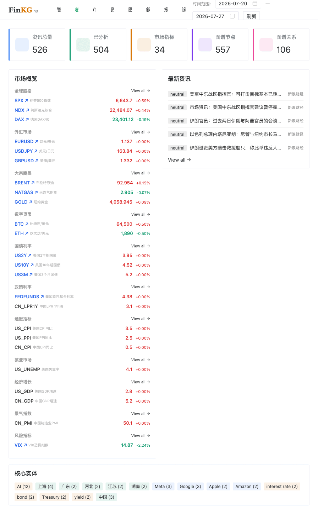

# Finkg — Financial Narrative Intelligence Platform

<p align="center">
  
  
  
  
  
  
</p>

<p align="center">
  <strong>Financial Narrative Intelligence Platform</strong> — A comprehensive system integrating finance, natural language processing, and knowledge graphs for narrative intelligence analysis.
</p>

<p align="center">
  <a href="README.md">中文</a> | <a href="README.en.md">English</a>
</p>

<div align="center">
  <a href="demo/finkg-demo.gif">
    
  </a>
  <br/>
  <em>System overview: Dashboard · Market · News · Graph · Narrative · API Docs</em>
</div>

<br/>

---

## Overview

Finkg is a **Financial Narrative Intelligence Platform** (v5.0) that aggregates, analyzes, and visualizes financial narratives from multiple sources. It combines real-time news crawling, NLP-powered sentiment analysis, entity extraction, topic modeling, and knowledge graph visualization to provide actionable financial intelligence.

### Key Features

- **Multi-source News Aggregation**: RSS feeds and web scraping from 15+ global financial sources (Reuters, CNBC, BBC, 36Kr, WallStreetCN, etc.)
- **Real-time Sentiment Analysis**: Three-tier NLP engine (rule-based → ML-based → LLM-powered) for adaptive accuracy
- **Entity Extraction & Topic Modeling**: Automatically identify key entities, themes, and narrative patterns
- **Knowledge Graph**: Entity-relationship visualization for discovering hidden connections
- **Market Data Dashboard**: 34+ market indicators (equities, FX, commodities, crypto, bonds, rates)
- **Automated Reports**: LLM-powered report generation with narrative analysis
- **Pipeline Orchestration**: Configurable data processing pipelines with scheduling

---

## Architecture

```
┌─────────────────────────────────────────────────────────┐
│                    Finkg System                          │
├─────────────────────────────────────────────────────────┤
│                                                         │
│  ┌──────────┐    ┌──────────┐    ┌──────────┐          │
│  │ Crawler  │───▶│  NLP     │───▶│  Storage │          │
│  │ RSS/Web  │    │ Engine   │    │ DB/Graph │          │
│  └──────────┘    └──────────┘    └──────────┘          │
│       │               │               │                 │
│       ▼               ▼               ▼                 │
│  ┌──────────┐    ┌──────────┐    ┌──────────┐          │
│  │  Market  │    │  Report  │    │  Frontend│          │
│  │  Data    │    │  Gen     │    │  Vue 3   │          │
│  └──────────┘    └──────────┘    └──────────┘          │
│                                                         │
│  API Layer: FastAPI v1 RESTful Endpoints                │
│  NLP Tiers: Rule → ML (scikit-learn) → LLM (OpenAI)    │
│  Storage: SQLite (dev) / PostgreSQL + Redis (prod)      │
│  Scheduling: APScheduler + Celery                       │
└─────────────────────────────────────────────────────────┘
```

### Backend Architecture

| Module | Description |
|--------|-------------|
| `api/v1/` | RESTful API endpoints (market, news, analysis, graph, report, narrative) |
| `services/nlp/` | NLP engine with rule-based, ML, and LLM modes |
| `services/crawler/` | RSS news feed and web scraping |
| `services/market/` | Market data aggregation (34+ indicators) |
| `services/graph/` | Knowledge graph entity-relationship management |
| `services/llm/` | OpenAI-compatible LLM client for report generation |
| `services/report/` | Automated narrative report generation |

### Frontend Architecture

| Module | Technology |
|--------|-----------|
| Framework | Vue 3 + Composition API |
| Language | TypeScript (strict mode) |
| UI Library | Naive UI |
| Charts | ECharts |
| State Management | Pinia |
| Routing | Vue Router 4 |

---

## Quick Start

### Prerequisites

- Python 3.11+
- Node.js 18+
- Docker & Docker Compose (optional, for production)

### Backend Setup (Development)

```bash
cd backend
cp .env.example .env
pip install -e ".[dev]"
uvicorn app.main:app --host 0.0.0.0 --port 8765 --reload
```

### Frontend Setup (Development)

```bash
cd frontend
npm install
npm run dev
```

### Docker Deployment (Production)

```bash
docker-compose up -d
# Backend: http://localhost:8765
# Frontend: http://localhost:5173
```

---

## Tech Stack

| Layer | Technology |
|-------|-----------|
| Backend Framework | FastAPI (Python 3.11+) |
| Database | SQLite (dev) / PostgreSQL 16 (prod) |
| Cache / Queue | Redis, Celery |
| ORM | SQLAlchemy 2.0 + Alembic |
| NLP | jieba (segmentation), scikit-learn (ML), rule engine |
| LLM | OpenAI-compatible API (DeepSeek, OpenAI, etc.) |
| Frontend | Vue 3 + TypeScript + Vite |
| UI | Naive UI + ECharts |
| State | Pinia |
| Deployment | Docker Compose, Nginx |

---

## Project Structure

```
Finkg/
├── backend/
│   ├── app/
│   │   ├── main.py              # FastAPI entry point
│   │   ├── config.py            # Pydantic settings
│   │   ├── database.py          # Database engine
│   │   ├── api/v1/              # RESTful API endpoints
│   │   ├── models/              # SQLAlchemy models
│   │   ├── schemas/             # Pydantic schemas
│   │   ├── services/
│   │   │   ├── nlp/             # NLP engine (sentiment/entity/topic)
│   │   │   ├── crawler/         # RSS & web crawler
│   │   │   ├── market/          # Market data
│   │   │   ├── graph/           # Knowledge graph
│   │   │   ├── llm/             # LLM client
│   │   │   ├── narrative/       # Narrative analysis
│   │   │   └── report/          # Report generation
│   │   └── utils/               # Utilities
│   ├── tests/                   # Test suite
│   ├── Dockerfile
│   └── pyproject.toml
├── frontend/
│   ├── src/
│   │   ├── App.vue              # Root component
│   │   ├── main.ts              # Entry point
│   │   ├── views/               # Page views
│   │   ├── router/              # Vue Router
│   │   ├── stores/              # Pinia stores
│   │   └── api/                 # API client
│   ├── Dockerfile
│   └── nginx.conf
├── docker-compose.yml           # Multi-container deployment
├── Makefile                     # Development commands
├── sources.json                 # News source config
├── README.en.md                 # English documentation
├── LICENSE                      # MIT License
└── wechat-qr.jpg                # WeChat QR code
```

---

## API Endpoints

| Method | Endpoint | Description |
|--------|----------|-------------|
| GET | `/` | API info & version |
| GET | `/docs` | Swagger UI documentation |
| GET | `/api/v1/status` | System status |
| GET | `/api/v1/market` | Market data (34+ indicators) |
| GET | `/api/v1/news` | News articles |
| GET | `/api/v1/analysis` | NLP analysis |
| GET | `/api/v1/graph` | Knowledge graph |
| GET | `/api/v1/narrative` | Narrative themes |
| GET | `/api/v1/report` | Generated reports |
| GET | `/api/v1/pipeline` | Data pipeline status |
| GET | `/api/v1/settings` | System settings |

---

## NLP Engine Tiers

Finkg features a modular three-tier NLP engine:

1. **Rule-based** (default): Fast sentiment scoring using financial lexicons, pattern matching, and rule-based entity extraction. Zero dependencies, suitable for real-time processing.

2. **ML-based**: Enhanced analysis using scikit-learn classifiers, TF-IDF vectorization, and clustering for topic discovery. Requires additional ML dependencies.

3. **LLM-powered**: Deep contextual understanding via OpenAI-compatible APIs. Supports complex narrative analysis, summarization, and report generation.

The engine auto-delegates to higher tiers when available, ensuring the best possible analysis with available resources.

---

## WeChat Contact

<div align="center">
  
  <p><b>Scan to connect — let's be friends or discuss collaboration</b></p>
</div>

---

## License

This project is open-sourced under the **MIT License**. See [LICENSE](LICENSE) for details.
